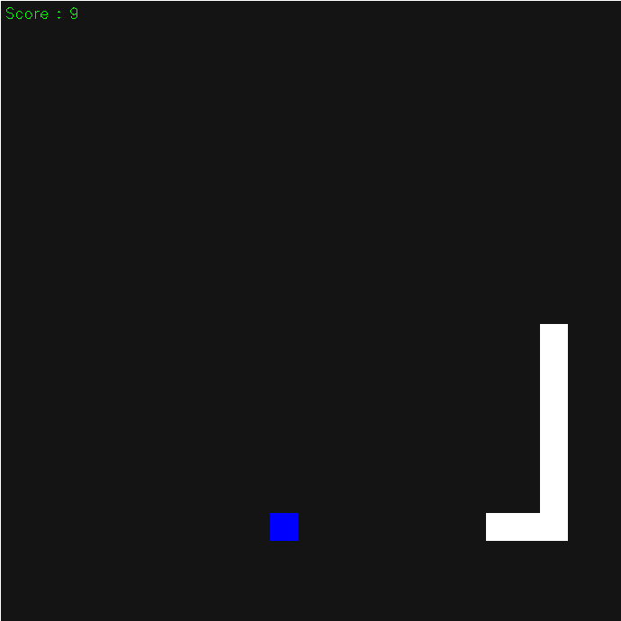

# Retro Snake Game
This is a simple snake game written in **python** utilising **open-cv** library \[Might not work as expected on Windows\]



## Dependencies
This game requires python 3.x.x or above and you will also need to install Open-CV. You can install python from [here](https://www.python.org/downloads/). To install Open-CV use the following command
```bash
pip install opencv-python
```
## Controls
* &#11014; Up

* &#11015; Down

* &#11013; Left

* &#10145; Right

* **Esc** to exit 